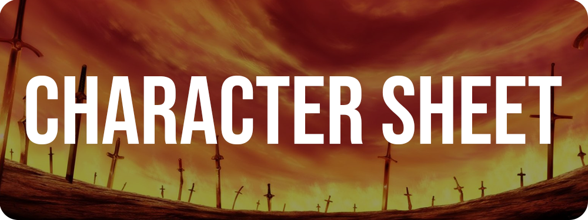

## 🤗 Introdução
Esse repositório contem uma aplicação que seu objetivo é criar uma ficha para rpg de mesa.

## ⚔️ Sobre o Projeto

Esse projeto foi feito em <a href="https://pt-br.reactjs.org" target="_blank">React</a>.   

O <a href="https://github.com/amoreira2003/CharacterSheet" target="_blank">Character Sheet</a> é um projeto para meu <a href="https://github.com/amoreira2003" target="_blank">portfólio</a> de **Front-End**

  

