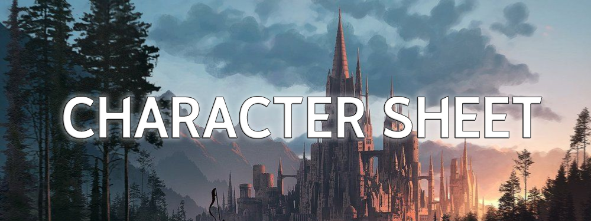

### 🤗 Introdução

Seja Muito bem víndo, antes de utilizar o projeto por favor leia as politicas de uso, essa character sheet foi feita baseada na idéia da ficha de personagem utilizados no [RPG Ordem Paranormal](https://ordemparanormal.fandom.com/wiki/Ordem_Paranormal_Wiki), código 100% original e feito por mim, é isso faça um bom uso da aplicação.

### 🤝 Politicas de Uso.

O Projeto é feito em open-source ou seja você pode alterar e utilizar o código para uso pessoal, você não pode vender esse codigo e nenhum codigo feito a partir dele, lembre-se de sempre deixar meus créditos, qualquer alteração no código original é bem vindo, você enviar um push ou me chamar no discord para me enviar o código e se for algo positivo para o projeto a alteração sera feita.

### ⚠️ Avisos Importantes.

O projeto esta em uma fase sensível é de extrema importância que todo os bugs principalmente os de segurança sejam reportados, é de recomendação extrema que utilize o sistema com pessoas que conheça e que não estejam mal-intencionadas, bugs de segurança não afetarão sua vida normal porém podem afetar as fichas de outros jogadores.

### ⚔️ Sobre o Projeto

Esse é o repositório responsável pelos códigos do Character Sheet que é um projeto desenvolvido por [Alexandre Moreira](https://www.youtube.com/channel/UC5Q048XTW9Qmsy9pKlm-38A), onde utilizando HTML5,CSS e JS é criado uma ficha de RPG responsiva que é possível utilizar em conjunto com o OBS e outros softwares de livestreaming e gravação, a ficha tem um sistema de rolagem de dados e o display dos personagens criados, existem muitas idéias e recursos que queremos adicionar, para acompanhar o desenvolvimento desse projeto [entre aqui.](https://trello.com/b/rSbQ2wID/charactersheet)

### 🛠 Como Utilizar

